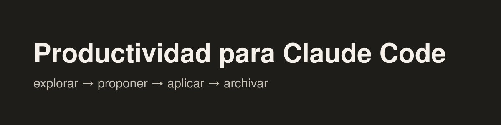

# Productividad para Claude Code

Marketplace de plugins de productividad para [Claude Code](https://code.claude.com), en español.

## Plugins disponibles

| Plugin | Qué hace | Comandos |
|---|---|---|
| [`proyectos`](plugins/proyectos/) | El ciclo de trabajo de una empresa en Markdown: explorar → proponer → aplicar → archivar, con reglas, plantillas y validador | `/proyectos:setup` · `explorar` · `proponer` · `aplicar` · `archivar` · `validar` · `reglas` |
| [`contenido`](plugins/contenido/) | Redactores que escriben con tu propia voz: uno por grupo de temas, a partir de tus recursos, una entrevista y textos tuyos | `/contenido:construir-redactores` |

## Instalación

### Claude Code: app de escritorio

Pestaña *Code*: botón **+** junto al cuadro de texto → **Plugins** → **Add plugin** → agrega el marketplace
`emmanuelbarturen/productividad-claude-code-marketplace` → instala el plugin que quieras.

### Claude Code: terminal

```
claude plugin marketplace add emmanuelbarturen/productividad-claude-code-marketplace
claude plugin install proyectos@productividad-claude-code-marketplace
```

### Actualizar

`/plugin` → *Marketplaces* → `productividad-claude-code-marketplace` → *Update*. Para recibir cambios solos, activa
*Enable auto-update* en ese mismo menú.

## Contribuir

Ver [CONTRIBUTING.md](CONTRIBUTING.md). Cada plugin lleva su historial en `plugins/<plugin>/VERSIONS.md`.

## Licencia

MIT.
